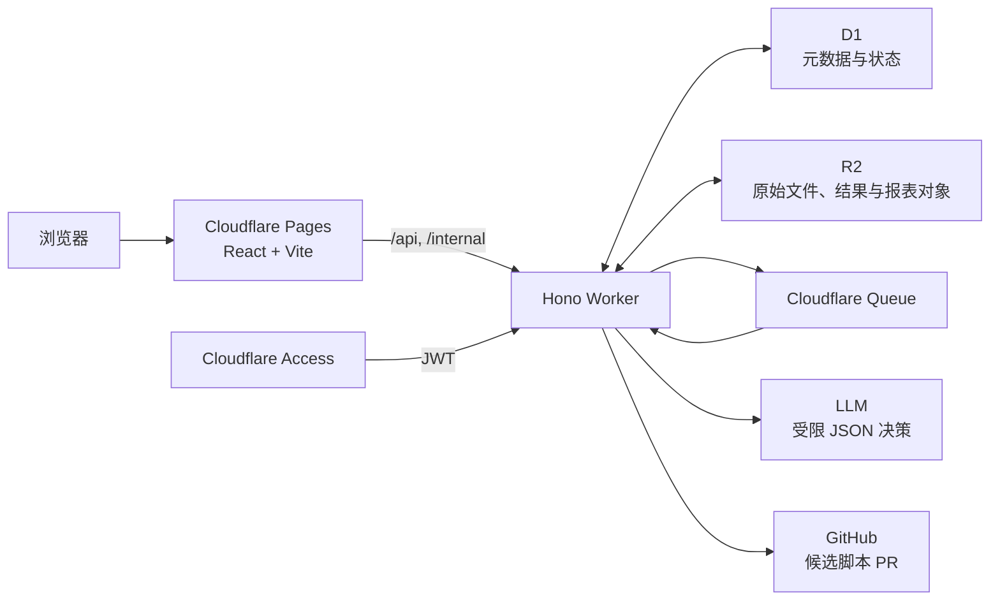
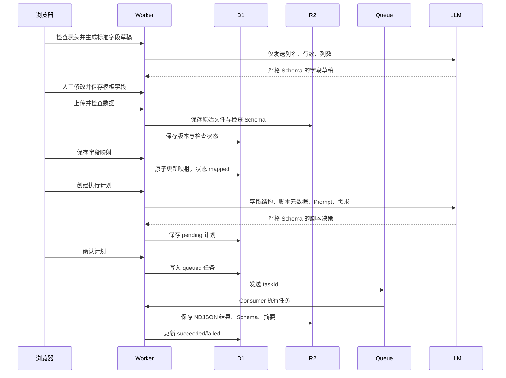

# 数据分析 Agent 架构交接文档

## 1. 系统定位与边界

这是一个面向固定 CSV/XLSX 数据源的**单用户**分析系统。用户先定义标准字段与 Prompt，再上传数据、显式映射字段、确认由模型推荐的静态分析脚本，最后预览并发布固定组件报表。

系统不支持多租户、运行时动态执行代码、自动字段猜测、自动合并脚本 PR 或任意 HTML/JS/CSS 报表。原始数据不会发送给 LLM：模型只接收字段结构、行列数、受控脚本元数据、Prompt 与用户需求。



## 2. 代码与部署结构

| 路径 | 责任 |
| --- | --- |
| `apps/web/` | React 19 前端、路由、页面状态、固定报表组件。 |
| `apps/worker/` | Hono API、认证、中间件、D1/R2/Queue 编排与 Queue Consumer。 |
| `packages/contracts/` | 前后端共享 Zod 请求、字段映射和脚本决策协议。 |
| `packages/scripts/` | 版本化静态分析脚本与注册表。 |
| `packages/script-sdk/` | 脚本的输入、输出、流式处理 SDK。 |
| `packages/report-schema/` | 受限报表配置协议。 |
| `tests/e2e/` | Playwright 完整主流程与异常流程。 |

生产环境中，Pages 承载前端；`/api/*`、`/internal/scripts/candidates`、`/internal/scripts/sync` 与 `/health` 由 Worker Route 接管。`/api/*` 和 `/internal/*` 在 Worker 内校验 `Cf-Access-Jwt-Assertion`；Cloudflare Access 是认证边界，隐藏页面 `/internal/scripts` 只是减少误入，不是安全边界。

## 3. 前端实现与使用方式

前端入口在 `apps/web/src/router.tsx`。主导航仅暴露“分析模板”和“上传数据”，候选脚本页位于隐藏路由 `/internal/scripts`。

| 页面 | 路由 | 作用 |
| --- | --- | --- |
| 模板列表/创建 | `/templates`、`/templates/new` | 定义标准字段、加工 Prompt、报表 Prompt。 |
| 上传数据 | `/datasets/new` | 上传 CSV/XLSX，选择 CSV 编码、分隔符或 Excel 工作表。 |
| 字段映射 | `/datasets/:versionId/mapping` | 将来源列显式映射到模板字段；必填字段缺失不可继续。 |
| 发起分析 | `/datasets/:versionId/analysis` | 维护加工 Prompt，提交本次加工需求并获取脚本推荐。 |
| 确认计划 | `/plans/:planId` | 展示精确脚本版本、输入输出字段与参数，用户确认后才入队。 |
| 任务状态 | `/tasks/:taskId` | 每 2 秒轮询执行状态；成功后进入报表创建。 |
| 报表编辑/查看 | `/tasks/:taskId/reports/new`、`/reports/:reportVersionId` | 生成受限报表配置、预览、确认发布和只读查看。 |

前端 API 客户端位于 `apps/web/src/api/client.ts`。生产默认请求同源路径；本地 Vite 将 `/api`、`/internal` 代理到 Worker。`ReportRenderer` 只通过显式 `switch` 渲染指标卡、表格和 ECharts 的柱/线/饼图，不动态执行模型输出。

### 业务操作顺序

1. 新建模板：至少定义一个标准字段，并填写加工与报表 Prompt。
2. 上传不超过 10 MB 的 CSV/XLSX；服务端同时校验文件名后缀、MIME、大小和模板 ID。
3. 检查文件结构，完成所有必填字段映射。
4. 提交加工需求，查看模型返回的“支持/拒绝”决策。
5. 确认脚本版本及参数，等待 Queue 完成任务。
6. 填写报表展示需求，预览固定组件报表并确认发布。

## 4. 后端数据与执行架构

### 存储职责

| 服务 | 保存内容 | 不保存内容 |
| --- | --- | --- |
| D1 | 模板、Prompt 版本、数据集版本索引、字段映射、脚本启用状态、计划、任务与报表版本状态。 | 原始数据行、大型结果集。 |
| R2 | 原始文件、检查 Schema、标准化 NDJSON、执行结果、结果 Schema/摘要、错误对象、报表配置与物化报表数据。 | 密钥。 |
| Queue | `{ taskId }` 异步任务消息。 | 原始文件和 LLM Prompt。 |

执行计划确认后，Worker 先在 D1 原子写入 `confirmed` 计划与 `queued` 任务，再投递 Queue。Consumer 将任务置为 `running`，从 R2 读取文件、按字段映射标准化记录、执行构建期静态脚本，并把结果与摘要写入 R2。任务状态为 `succeeded` 或 `failed`；仅暂时性基础设施错误最多重试三次。



### LLM 与受控协议

加工模型只能在 D1 中 `enabled=1`、且当前构建注册表存在的精确 `scriptId@version` 中选择。Worker 在**推荐前**校验字段与参数，在**确认执行前**再次校验启用状态、脚本版本、参数和字段类型。

报表模型只能生成 `ReportConfigSchema`：筛选器仅支持单选、多选、日期范围；组件仅支持 `metric`、`table`、`bar`、`line`、`pie`。模型不能返回代码、HTML、CSS、运行时表达式或未知字段。

## 5. API 清单

除 `GET /health` 外均要求 Access JWT；`/internal/*` 还用于受保护的管理操作。

| 方法 | 路径 | 用途 |
| --- | --- | --- |
| `GET` | `/health` | 存活检查。 |
| `POST` / `GET` | `/api/templates` | 创建/列出模板；创建前可使用生成字段草稿。 |
| `POST` | `/api/templates/inspect-source` | 不绑定模板，仅检查 CSV/XLSX 表头和规模。 |
| `POST` | `/api/templates/generate-fields` | 根据检查结果请求 LLM 生成标准字段草稿。 |
| `GET` | `/api/templates/:id` | 获取模板与当前 Prompt。 |
| `POST` | `/api/templates/:id/prompts` | 新建加工或报表 Prompt 版本。 |
| `POST` | `/api/datasets` | 上传 CSV/XLSX 原始文件。 |
| `POST` | `/api/datasets/:versionId/inspect` | 检查 CSV 编码/分隔符或选择 XLSX 工作表。 |
| `PUT` | `/api/datasets/:versionId/mapping` | 保存并校验字段映射。 |
| `GET` | `/api/datasets/:id` | 查询数据集与版本状态。 |
| `GET` | `/api/dataset-versions/:id/analysis-context` | 获取加工 Prompt 与分析上下文。 |
| `POST` | `/api/dataset-versions/:id/plans` | 请求脚本推荐并创建待确认计划。 |
| `GET` / `POST` | `/api/plans/:id`、`/api/plans/:id/confirm` | 获取并确认计划；确认后返回任务 ID。 |
| `GET` | `/api/tasks/:id` | 查询任务状态、摘要或错误。 |
| `GET` / `POST` | `/api/tasks/:taskId/report-context`、`/api/tasks/:taskId/reports` | 获取报表上下文、创建报表草稿。 |
| `GET` / `POST` | `/api/report-versions/:id`、`/api/report-versions/:id/confirm` | 获取报表版本、确认发布。 |
| `GET` | `/api/report-versions/:id/data` | 获取物化后的报表行数据。 |
| `POST` | `/internal/scripts/candidates` | 创建候选脚本分支与 Pull Request。 |
| `POST` | `/internal/scripts/sync` | 将当前构建脚本目录原子同步到 D1。 |

模板创建页会预填受控的数据加工和报表 Prompt。维护者可以在放大编辑器中修改后保存；最终文本作为模板的 v1 Prompt 写入，运行时编辑仍通过 Prompt 版本接口生成新版本。表头检查读取实际请求体大小进行 10 MB 限制校验，不依赖浏览器不可设置的 `Content-Length` 请求头。

## 6. 脚本发布与部署

候选脚本不会直接执行。正确路径是：隐藏管理页创建候选分支 → GitHub Pull Request → CI 校验 → 人工合并 → 部署 Worker → 调用 `/internal/scripts/sync` → D1 将当前构建脚本标记为 `enabled=1`。脚本目录同步失败时不会留下半套启用状态。

CI 在 PR 与 `main` push 时执行 `validate:scripts`、类型检查、单元测试、构建和 E2E。`main` 部署工作流按“Migration → Worker → Pages → 脚本目录同步”的顺序执行。生产密钥仅保存在 Worker Secret 或 GitHub Actions Secret。

## 7. 本地开发、验证与排障

```bash
corepack enable
pnpm install --frozen-lockfile
cp apps/worker/.dev.vars.example apps/worker/.dev.vars
# 填写 LLM_API_KEY；调试候选脚本 PR 时再填写 GITHUB_TOKEN
pnpm dev:worker
pnpm dev:web
```

`pnpm dev:worker` 使用 `.wrangler/dev-state` 初始化本地 D1、R2、Queue 与脚本目录。Vite 开发代理仅在 Worker 的 `ENVIRONMENT=development` 时注入固定本地开发身份；生产和测试环境不会接受该标记，仍校验 JWT。

提交前验证：

```bash
pnpm validate:scripts
pnpm typecheck
pnpm test
pnpm build
pnpm test:e2e
```

排障时优先保留 `requestId`、`taskId`、`scriptId@version` 和部署 Commit。不要记录或传播 Prompt、原始数据、R2 Object Key、LLM Key、GitHub Token。详细生产部署与恢复操作见 `docs/runbooks/cloudflare-deployment.md`、`docs/runbooks/incident-recovery.md`。
