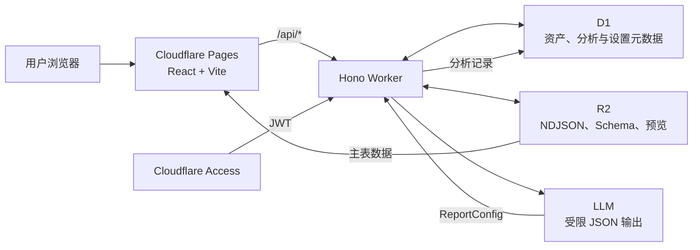
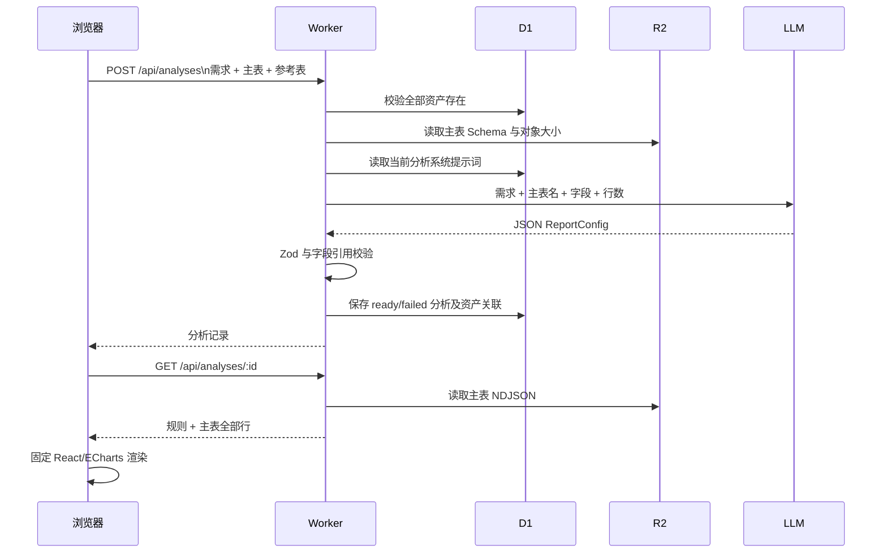

# 数据分析 Agent 架构交接文档

## 1. 当前系统定位

这是一个面向单用户的 Cloudflare 数据分析产品，当前主流程是：上传 CSV/XLSX → 形成可复用的数据资产 → 选择一张主表和零至多张参考表发起分析 → 由 LLM 生成并校验受限图表配置 → 在前端基于主表数据渲染分析结果。

系统的核心对象已从早期的“模板、字段映射、脚本执行任务、报表发布”收敛为：

- **数据资产**：上传后标准化为 NDJSON，连同字段 Schema、预览和识别元数据持久化，可反复用于分析。
- **分析记录**：一次不可变的分析需求、关联资产、所用系统提示词版本、规则配置或失败指引。
- **系统设置**：分析规则提示词的版本和激活状态，以及图表展示默认配置。

不支持多租户、运行时执行 LLM 生成代码、任意 HTML/JS/CSS、自动字段映射、跨表 Join 或完整数据导出。参考表可随分析记录保存并展示，但当前 LLM 规则生成和图表渲染只使用主表；跨表计算尚未实现。

原始行数据不发送给 LLM。分析规则模型仅接收主表名称、字段 Schema、行数和用户需求；资产元数据建议模型仅接收资产名称、行数和用户填写的说明；失败诊断模型仅接收需求、字段和可修复的规则失败原因。



## 2. 代码与部署结构

| 路径 | 当前责任 |
| --- | --- |
| `apps/web/` | React 19 + Vite 前端，采用 Ant Design；包含数据资产、数据分析和系统设置页面。 |
| `apps/worker/` | Hono API、Access 鉴权、CSV/XLSX 解析、R2/D1 编排、LLM 调用与错误处理。 |
| `packages/report-schema/` | LLM 分析规则与前端图表的受限 Zod 协议及字段引用校验。 |
| `packages/contracts/` | 早期模板、字段、脚本相关共享协议；当前主链路不再经过这些接口。 |
| `packages/script-sdk/`、`packages/scripts/` | 历史静态脚本 SDK 与注册表，保留在 workspace 中，但不是当前资产分析运行链路。 |
| `tests/e2e/` | Playwright 端到端覆盖与测试数据。 |
| `docs/runbooks/` | Cloudflare 部署与故障恢复手册。 |

生产环境中，Pages 承载前端，Worker 提供 `/api/*` 与 `/health`。除 `GET /health` 外，所有 API 都校验 `Cf-Access-Jwt-Assertion`：JWT 必须通过 Access issuer、audience 和邮箱声明校验。Cloudflare Access 是认证边界；本地开发仅在 `ENVIRONMENT=development` 且 Vite 代理注入固定开发标记时模拟身份，测试环境仍校验完整测试 JWT。

## 3. 前端信息架构

前端路由定义于 `apps/web/src/router.tsx`，根路径重定向到 `/assets`。

| 页面 | 路由 | 作用 |
| --- | --- | --- |
| 我的数据 | `/assets` | 列出可用数据资产，进入详情或开始分析。 |
| 上传数据 | `/assets/upload` | 上传 CSV/XLSX，并提供 CSV 编码、分隔符或 Excel 工作表选择。 |
| 数据资产详情 | `/assets/:assetId` | 展示前 50 行预览，维护名称、说明和标签；可请求 LLM 给出可编辑的元数据建议。 |
| 数据分析 | `/analyses` | 分页查看成功和失败的分析历史。 |
| 分析详情 | `/analyses/:analysisId` | 展示关联主表/参考表、规则 JSON、固定图表和主表前端数据；支持当前会话内拖拽排序、调整行高和刷新图表。 |
| 系统设置 | `/settings` | 管理分析规则提示词版本、恢复默认版本、切换历史版本，以及图表默认列数和行高。 |

`apps/web/src/api/client.ts` 默认请求同源 `/api`；设置 `VITE_API_BASE_URL` 后才会使用独立 API 地址。本地 Vite 将 `/api` 代理至 Worker。

分析详情的组件排版、拖拽排序、行高调整与图表刷新是浏览器内状态，当前不会回写或改变已保存的分析规则。前端只渲染 `ReportConfig` 白名单中的图表、指标卡和表格，不执行模型返回的代码。

## 4. 数据存储与资产生命周期

### 存储边界

| 服务 | 保存内容 |
| --- | --- |
| D1 | 数据资产控制面元数据、分析记录、分析与资产关联、系统提示词版本/激活状态、图表展示设置。 |
| R2 | 标准化 NDJSON、字段 Schema、资产预览对象。 |
| LLM | 仅接收严格受限的字段/规模/用户文字上下文，不持有 R2 数据行。 |

当前 Worker 未绑定 Queue；分析规则在请求中同步生成并保存，不存在“确认计划后入队执行”的任务状态机。

### 上传和资产化

1. 客户端提交文件名、文件内容和 CSV 参数；XLSX 未指定工作表时，Worker 返回工作表列表等待用户选择。
2. Worker 用 `csv-parse` 或 `xlsx` 解析文件，要求表头非空且不重复。
3. 每行转换为以原始表头为 key 的 JSON，并写入 R2 NDJSON；同时写入字段 Schema 和最多 50 行的预览对象。
4. Worker 在 D1 创建 `source` 类型、`ready` 状态的数据资产。初始名称取自去掉扩展名的文件名，描述为空，标签为空数组。
5. 用户可修改资产名称、说明和标签；这些元数据仅用于人工识别和筛选，绝不参与分析计算。

当前实现直接解析请求体并写入 R2；架构文档不应再宣称旧链路中的模板绑定、字段映射、10 MB/10 万行/200 列限制或异步标准化任务仍在生效，除非代码重新引入这些校验。

## 5. 分析生成与展示



创建分析时，请求必须包含 1 至 20 个不重复的资产 ID，且 `primaryAssetId` 必须在所选资产内。Worker 会校验所有资产存在，但目前只有主表的字段、行数和对象大小进入 `ReportConfig` 校验与 LLM 上下文。

成功时，D1 写入 `analyses.status = ready`、需求、标题、受限配置、操作者和当前提示词版本；`analysis_data_assets` 保存 `primary` 或 `reference` 角色。详情读取时，从 R2 返回主表全部 NDJSON 行供浏览器图表计算，因此不适合将超大数据集直接用于当前展示链路。

规则生成、协议解析或字段校验失败时，Worker 会保存 `failed` 分析。对于字段或规则不匹配等用户可修复错误，会尝试生成“失败摘要、修改建议、可直接重提的需求”；网络、数据库、超时等基础设施失败不应归因于用户。

### 受限规则协议

`packages/report-schema` 使用 Zod 校验 `ReportConfig`，其顶层仅含标题、说明、筛选器和组件。当前受支持的组件是：

- 图表：`bar`、`line`、`pie`，使用 `dimension`、`metric`，并支持 `sum`/`count` 聚合和折线/柱状图的可选 `series`。
- 指标卡：`metric`。
- 表格：`table`。
- 筛选器：`select`、`multi-select`、`date-range`。

所有引用必须来自主表 Schema，`dataset` 固定为 `result`。模型只能返回 JSON；不能返回代码、HTML、CSS、运行时表达式、任意数据查询或未知字段。Worker 在解析后再执行字段与数据规模校验，前端再以固定组件渲染，形成双重约束。

## 6. 系统提示词与展示设置

分析规则提示词保存在 `system_prompt_versions`，并由 `system_prompt_settings` 指向当前激活版本：

- 保存设置会创建新的人工版本，不覆盖历史内容。
- 可切换任一历史版本，或恢复当前内置默认版本。
- 每个分析记录保存实际使用的 `promptVersionId`，便于追溯规则来源。

图表展示设置保存在 `system_analysis_display_settings`，包括每行 1、2 或 3 个图表，以及 240–800 px 的默认行高。它影响后续打开分析详情时的初始布局，不会改写已保存的 `ReportConfig`。

## 7. 当前 API 清单

除 `GET /health` 外，以下接口都要求 Access JWT。

| 方法 | 路径 | 用途 |
| --- | --- | --- |
| `GET` | `/health` | 存活检查。 |
| `POST` | `/api/assets/upload` | 上传 CSV/XLSX，创建 source 数据资产或返回待选工作表。 |
| `GET` | `/api/assets` | 列出数据资产。 |
| `GET` | `/api/assets/:id` | 获取一项数据资产的控制面信息。 |
| `GET` | `/api/assets/:id/preview` | 读取最多 50 行资产预览。 |
| `PUT` | `/api/assets/:id/metadata` | 更新名称、说明和标签。 |
| `POST` | `/api/assets/:id/metadata-suggestions` | 基于控制面信息和用户说明生成可编辑元数据建议。 |
| `GET` | `/api/analyses?page=&pageSize=` | 分页列出分析历史。 |
| `POST` | `/api/analyses` | 创建成功或失败的分析记录。 |
| `GET` | `/api/analyses/:analysisId` | 获取分析详情、主表行和规则。 |
| `GET` | `/api/settings/analysis-prompt` | 获取当前分析提示词。 |
| `GET` | `/api/settings/analysis-prompt/versions` | 获取分析提示词历史版本。 |
| `PUT` | `/api/settings/analysis-prompt` | 保存新的人工提示词版本。 |
| `POST` | `/api/settings/analysis-prompt/restore-default` | 恢复默认提示词版本。 |
| `POST` | `/api/settings/analysis-prompt/versions/:id/activate` | 激活指定提示词版本。 |
| `GET` / `PUT` | `/api/settings/analysis-display` | 获取或更新图表展示默认配置。 |

早期的 `/api/templates`、`/api/datasets`、`/api/plans`、`/api/tasks`、`/api/report-versions` 和 `/internal/scripts/*` 不再由当前 `apps/worker/src/index.ts` 注册，不能作为现行 API 或部署流程描述。

## 8. LLM、日志与安全边界

Worker 使用 `LLM_BASE_URL`、`LLM_MODEL` 和 `LLM_API_KEY` 调用兼容 Chat Completions 的上游，并请求 `json_object` 响应格式。所有模型输出均需通过本地 Zod 协议验证；上游 HTTP 异常、超时和协议错误会归一为受控错误码，例如 `LLM_REQUEST_FAILED`、`LLM_REQUEST_TIMEOUT`、`LLM_INVALID_RESPONSE`。

常规日志仅保留请求 ID、阶段、耗时、数量、上游状态和协议失败原因。`LOG_SENSITIVE_DEBUG` 仅用于受控调试场景；其对应日志可能包含模型输入/输出或数据样本，生产环境不得开启或外传。不得记录或传播 `LLM_API_KEY`、Access 凭证及其他 Secret。

## 9. 本地开发与验证

项目要求 Node `22.23.1` 和 pnpm `11.9.0`。在仓库根目录执行：

```bash
corepack enable
pnpm install --frozen-lockfile
cp apps/worker/.dev.vars.example apps/worker/.dev.vars
# 填写 LLM_API_KEY
pnpm dev:worker
pnpm dev:web
```

`pnpm dev:worker` 初始化本地 D1、R2 与 Worker 开发状态；`pnpm dev:web` 启动带本地开发认证代理的 Vite。提交前按改动范围执行：

```bash
pnpm validate:scripts
pnpm typecheck
pnpm test
pnpm build
pnpm test:e2e
```

生产部署、Access 配置、Bindings、Secret 和恢复流程以 `docs/runbooks/cloudflare-deployment.md` 与 `docs/runbooks/incident-recovery.md` 为准。
