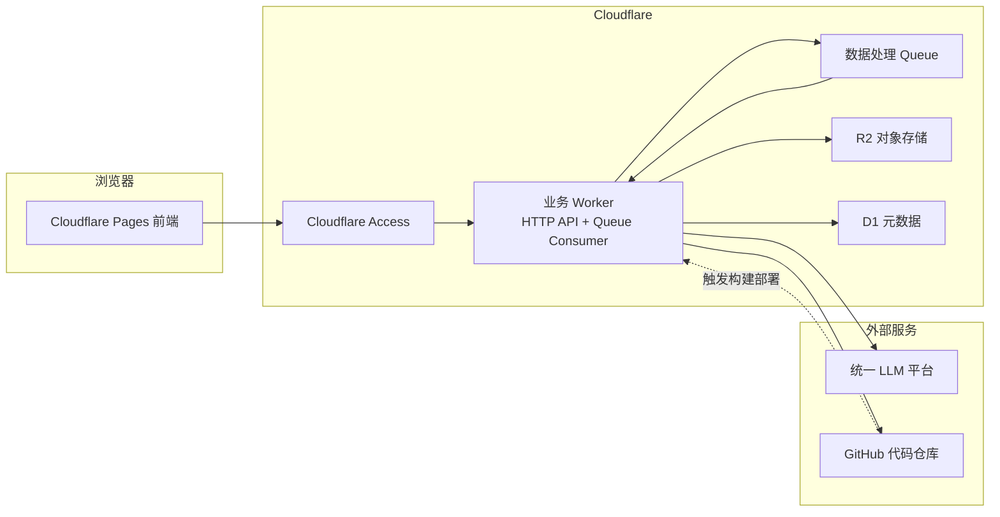
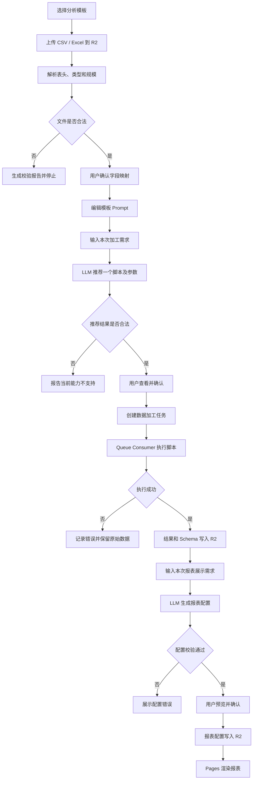
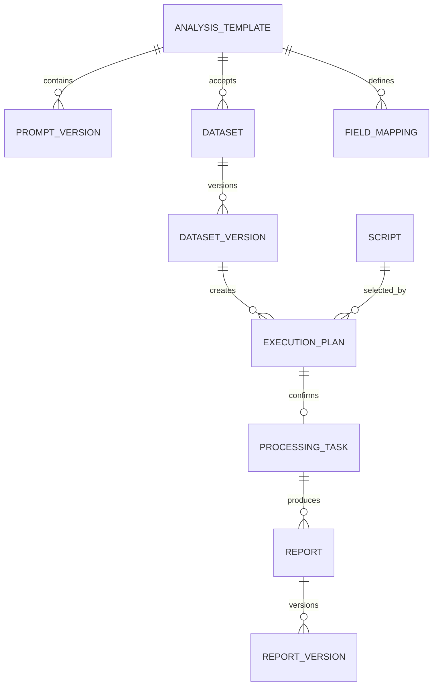
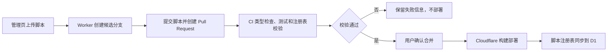

# 定制化数据分析 Agent 设计

- 日期：2026-07-14
- 状态：设计已通过讨论，等待书面规格复核
- 部署目标：Cloudflare Pages、Workers、Queues、R2、D1
- 用户边界：单个可信用户自用

## 1. 项目目标

构建一个面向固定格式 CSV、Excel 数据源的定制化数据分析系统。用户基于分析模板上传数据、显式完成字段映射、输入本次客制化加工需求，由 LLM 从已部署脚本中推荐一个完整处理脚本。用户确认后，系统异步执行脚本并将结果保存到 R2。

数据展示阶段使用独立的预设 Prompt 和本次展示需求，由 LLM 生成受控的报表 JSON 配置。Cloudflare Pages 使用预设图表组件和布局规则渲染报表。

第一阶段追求边界清晰、结果稳定、成本可控和可追溯，不建设通用数据平台或多租户 SaaS。

## 2. 已确认的产品约束

- 系统只供单个可信用户使用，不设计用户、组织、租户和角色体系。
- 单个上传文件最大 10 MB，最大 10 万行，最大 200 列。
- 第一阶段只支持 CSV 和结构明确的 `.xlsx`。
- Excel 每次只处理用户明确选择的一个工作表。
- 输入字段采用用户显式映射，不由系统或 LLM 自动猜测。
- 缺少必填字段、字段类型错误或数据超限时直接终止，不做字段兜底、静默截断或自动抽样。
- LLM 只理解需求、推荐一个已部署脚本及参数，并生成报表配置。
- LLM 不读取实际数据行，不直接加工数据，不生成或执行代码。
- 每次任务只执行一个完整脚本，不组合多个脚本。
- 用户必须确认 LLM 推荐结果后才能创建数据加工任务。
- 前端使用固定图表组件库；LLM 只生成满足 Schema 的 JSON 配置。
- 报表数据提前加工并保存到 R2，页面只做展示、排序和少量本地筛选。
- 第一阶段不引入 R2 SQL、R2 Data Catalog 或实时查询引擎。
- 系统只配置一个逻辑模型名称；实际模型切换由外部 LLM 平台完成。
- 脚本上传后通过代码仓库 CI 和 Cloudflare 构建部署生效，不要求即时执行。

## 3. 总体架构



第一阶段采用两个部署单元：

1. `apps/web` 部署到 Cloudflare Pages。
2. `apps/worker` 部署为一个 Workers Paid Worker，同时提供 HTTP API 和 Queue Consumer。

选择 Workers Paid 是因为免费计划的单次 CPU 时间不适合解析 CSV、Excel 和运行数据加工脚本。Worker 内存上限为 128 MB，因此数据读写必须优先采用流式处理。

### 3.1 第一阶段技术栈

为避免实施阶段再次出现基础选型分叉，第一阶段固定采用：

- Monorepo 与依赖管理：pnpm workspace。
- 前端：React、Vite、TypeScript、React Router。
- 图表：Apache ECharts，前端封装为受控报表组件。
- Worker HTTP 路由：Hono。
- 运行时 Schema：Zod，前后端、LLM 响应、脚本和报表共享契约。
- D1 数据访问：Drizzle ORM 和显式 SQL Migration。
- 单元及集成测试：Vitest。
- 端到端测试：Playwright。

不引入服务端渲染框架。Pages 输出静态前端资源，所有动态能力通过 Worker API 提供。

## 4. 模块职责

### 4.1 Pages 前端

前端负责：

- 分析模板管理。
- CSV、Excel 上传。
- Excel 工作表选择。
- 字段映射确认。
- 模板 Prompt 编辑及版本查看。
- 单次客制化加工需求输入。
- LLM 推荐方案展示及人工确认。
- 任务状态查看。
- 报表配置预览、确认和渲染。
- 结果及导出文件下载入口。
- 隐藏的脚本上传管理页。

前端不保存服务端 Secret，不直接访问私有 R2 Bucket，不执行可信数据加工逻辑。

### 4.2 业务 Worker

HTTP API 负责：

- 验证 Cloudflare Access 身份。
- 流式接收小于等于 10 MB 的上传文件并写入 R2。
- 读取文件字段结构并执行确定性校验。
- 保存用户明确确认的字段映射。
- 构造不包含实际数据行的 LLM 请求。
- 校验 LLM 结构化响应。
- 保存执行计划和用户确认快照。
- 创建异步任务并投递任务 ID。
- 返回任务、结果和报表状态。
- 将管理员上传脚本提交为候选代码分支并创建 Pull Request。

Queue Consumer 负责：

- 根据任务 ID 读取 D1 中的确认快照。
- 从 R2 流式读取输入数据。
- 应用显式字段映射。
- 加载已确认的脚本 ID 和精确版本。
- 校验脚本参数和输入 Schema。
- 执行完整数据加工。
- 校验输出 Schema。
- 将结果、摘要和错误报告写入 R2。
- 更新 D1 任务状态。

### 4.3 R2

R2 保存所有数据实体和大对象：

- 原始 CSV、Excel。
- 标准化 NDJSON。
- 脚本加工结果。
- 校验和执行错误报告。
- 报表数据集。
- 报表配置。
- 导出文件。

正式对象默认不可变。重新加工或重新生成报表时创建新版本，不覆盖历史版本。

### 4.4 D1

D1 只保存控制面数据：

- 分析模板。
- Prompt 版本。
- 数据集及版本索引。
- R2 对象 Key。
- 字段 Schema 和显式映射。
- 脚本元数据及版本。
- LLM 推荐快照。
- 用户确认记录。
- 任务状态。
- 报表及版本索引。

D1 不保存完整业务数据行。

### 4.5 LLM 平台

LLM 只承担：

1. 根据模板 Prompt、本次需求、数据 Schema 和脚本元数据，推荐一个已部署脚本及参数。
2. 根据报表 Prompt、本次展示需求、加工结果 Schema 和组件清单，生成报表 JSON 配置。

LLM 不获得实际数据值、原始文件地址、R2 访问凭证、LLM Secret 或 GitHub Token。

## 5. 数据生命周期



### 5.1 上传与校验

系统执行以下确定性校验：

- 文件大小不超过 10 MB。
- 行数不超过 10 万。
- 列数不超过 200。
- CSV 编码和分隔符必须可以确定；无法确定时要求用户明确选择。
- Excel 必须由用户选择一个工作表。
- 必填字段必须完成显式映射。
- 类型错误必须给出行号、字段名和原始值。

校验失败时保留原始文件和错误报告，不生成标准化数据。

### 5.2 LLM 推荐快照

用户确认时保存：

- 逻辑模型名称。
- 模板 Prompt 精确版本。
- 本次用户需求。
- 脚本 ID 和精确版本。
- 结构化参数。
- 匹配理由和能力限制。
- 确认时间。

Queue 执行时只读取该快照，不重新调用 LLM，也不重新选择脚本。已经被任务引用的脚本版本不得直接删除。

### 5.3 任务状态

```text
draft
→ awaiting_confirmation
→ queued
→ running
→ succeeded

任意执行阶段 → failed
```

失败任务不自动更换脚本，不自动修改参数。用户可以基于原配置创建新任务。

### 5.4 幂等执行

- 每个任务生成唯一 `taskId`。
- Queue 消息只携带 `taskId`，不携带业务数据。
- 输出先写入任务专属临时目录。
- 结果 Schema 校验成功后，D1 才切换正式结果指针。
- 已完成任务收到重复消息时直接确认消息，不重复执行。
- 失败重试只覆盖临时对象，不覆盖已发布结果。

## 6. R2 对象结构

```text
data-analyze/
├── datasets/
│   └── {datasetId}/
│       └── {datasetVersion}/
│           ├── source/original.{csv|xlsx}
│           ├── validation/schema.json
│           ├── validation/errors.ndjson
│           └── normalized/data.ndjson
├── tasks/
│   └── {taskId}/
│       ├── temporary/processing.ndjson
│       ├── result/data.ndjson
│       ├── result/schema.json
│       ├── result/summary.json
│       └── errors/execution.json
├── reports/
│   └── {reportId}/
│       └── {reportVersion}/
│           ├── report.json
│           └── data.json
└── exports/
    └── {exportId}/result.{csv|xlsx}
```

标准化数据和完整加工结果使用 NDJSON，便于 Worker 逐行读写。报表数据经过脚本聚合后使用普通 JSON，供 Pages 一次读取和渲染。

## 7. D1 数据模型



核心表：

- `analysis_templates`：模板名称、说明、输入 Schema、当前加工 Prompt 版本、当前报表 Prompt 版本。
- `prompt_versions`：所属模板、类型、版本、内容、创建时间。
- `datasets`：数据集名称、所属模板、创建时间。
- `dataset_versions`：原始文件 Key、Schema Key、格式、工作表、行列数、校验状态。
- `field_mappings`：来源字段、标准字段、标准类型、必填性。
- `scripts`：脚本 ID、版本、能力说明、输入 Schema、参数 Schema、输出 Schema、部署版本和可用状态。
- `execution_plans`：数据集版本、用户需求、Prompt 版本、LLM 响应、推荐脚本、参数、理由、限制和确认状态。
- `processing_tasks`：执行计划、状态、Queue 时间、执行时间、R2 结果 Key、错误 Key 和重试次数。
- `reports`：来源任务和报表标识。
- `report_versions`：展示需求、Prompt 版本、配置 Key、数据 Key、校验状态和确认时间。

页面删除只标记记录不可见，不立即删除 R2 对象。第一阶段不做自动生命周期清理。

构建产物中的脚本注册表是脚本能力的事实来源；D1 的 `scripts` 表是用于页面查询和历史引用的同步索引。同步失败时，新部署脚本不对新任务开放，已有脚本版本继续按已确认快照执行。

## 8. Prompt 与 LLM 协议

### 8.1 Prompt 分层

```text
平台规则（固定、不可编辑）
+ 模板 Prompt（预设、可编辑、版本化）
+ 本次用户需求（单次保存）
```

平台规则要求模型：

- 只能推荐清单中存在的一个脚本。
- 不得生成代码或组合脚本。
- 不得发明参数、字段和版本。
- 无法满足时必须返回 `supported: false`。
- 必须严格返回指定 JSON Schema。

### 8.2 脚本推荐响应

成功响应：

```json
{
  "supported": true,
  "scriptId": "regional-sales-analysis",
  "scriptVersion": "1.2.0",
  "parameters": {
    "groupBy": "region"
  },
  "reason": "字段结构和需求均符合该脚本能力",
  "limitations": []
}
```

无法满足：

```json
{
  "supported": false,
  "scriptId": null,
  "scriptVersion": null,
  "parameters": null,
  "reason": "当前脚本库不包含同比计算能力",
  "limitations": ["缺少上年同期数据处理能力"]
}
```

协议中的 `null` 表示字段明确不适用，不是兜底值。

Worker 依次校验响应 Schema、脚本及版本、输入字段、参数 Schema 和脚本可用状态。任一校验失败即停止，不选择替代脚本。

## 9. 数据处理脚本协议

每个脚本必须是一个可独立完成任务的版本化模块，并公开：

- 脚本 ID 和版本。
- 名称和能力说明。
- 输入 Schema。
- 参数 Schema。
- 输出 Schema。
- 处理函数。
- 固定输入输出测试。

脚本通过平台提供的流式接口读取完成字段映射的数据，并将结果写入临时输出流。运行上下文只提供：

- 当前任务输入记录流。
- 已校验的参数。
- 当前任务输出写入器。
- 受控日志接口。
- 任务 ID、脚本 ID 和版本。

脚本不获得 LLM Secret、GitHub Token、Cloudflare 管理 Token、任意 D1 查询接口、任意 R2 Bucket 接口或浏览器请求信息。

普通 Worker 中的模块共享运行环境，因此这属于接口隔离，不是针对恶意代码的强沙箱。脚本上传权限只授予可信管理员，上传脚本视为受信代码。

## 10. 报表系统

### 10.1 报表生成

报表 LLM 获得：

- 报表模板 Prompt。
- 本次展示需求。
- 加工结果字段名称、类型和说明。
- 固定组件清单。
- 报表配置 JSON Schema。

LLM 不读取报表数据实际值。若用户需要的指标不存在，系统返回当前数据集不支持，不允许模型编造字段或计算逻辑。

### 10.2 第一批组件

- 指标卡。
- 数据表格。
- 柱状图。
- 折线图。
- 饼图。
- 单选、多选筛选器。
- 日期范围筛选器。

LLM 只能设置组件类型、数据集、维度、指标、展示格式以及栅格 `x`、`y`、`w`、`h`。LLM 不得输出 HTML、JavaScript、CSS 或运行时表达式。

### 10.3 报表限制

- 单个 `report/data.json` 不超过 5 MB。
- 单个图表不超过 5,000 个数据点。
- 表格报表不超过 10,000 行。
- 超限时拒绝发布，不自动抽样或截断。
- 页面筛选、排序和联动仅针对已下载报表数据，不发起实时 SQL 查询。

## 11. 前端页面

```text
/
├── /templates
│   ├── /new
│   └── /:templateId
├── /datasets
│   ├── /new
│   └── /:datasetId
│       ├── /mapping
│       └── /analysis
├── /tasks/:taskId
├── /reports/:reportId
└── /internal/scripts
```

`/internal/scripts` 不出现在导航、站点地图或普通页面链接中，并通过 Cloudflare Access 保护。隐藏路径不是认证边界。

## 12. 脚本上传与发布

第一阶段采用 GitHub 作为代码托管平台：



候选分支固定使用 `script-candidate/{scriptId}-{version}`。第一阶段保留人工合并，因为构建成功不能证明业务逻辑正确。

## 13. 安全设计

- 管理站点和 Worker API 通过 Cloudflare Access 保护。
- R2 Bucket 保持私有，只允许 Worker Binding 访问。
- `LLM_API_KEY`、`LLM_BASE_URL`、`LLM_MODEL` 使用 Worker Secrets。
- GitHub 使用只授权当前仓库所需操作的细粒度 Token。
- 日志不记录 Prompt 全文、密钥、原始数据内容或临时访问凭证。
- LLM 请求使用专用序列化器，只能从允许的元数据对象构造请求。
- LLM 响应在执行前必须通过运行时 Schema 校验。
- 脚本上传路由同时受 Cloudflare Access 和服务端方法、内容类型、文件大小校验约束。

## 14. 错误处理与重试

| 阶段 | 典型错误 | 行为 |
|---|---|---|
| 上传 | 文件超限、格式错误 | 拒绝并明确展示原因 |
| 字段映射 | 必填字段未映射 | 不允许进入推荐阶段 |
| LLM 推荐 | 超时、非 JSON、Schema 不符 | 推荐失败，允许用户手动重试 |
| 推荐校验 | 脚本不存在、参数非法 | 拒绝确认，不选择替代脚本 |
| Queue | 消息重复 | 根据任务 ID 幂等跳过 |
| 脚本执行 | 类型或业务错误 | 停止任务并保存结构化错误 |
| 结果校验 | 输出不符合 Schema | 不发布结果 |
| 报表生成 | 引用不存在字段 | 不允许发布 |
| 部署 | CI 或构建失败 | 保留当前生产版本 |

Queue 最多自动重试三次，且只重试 R2 临时失败等平台暂时性错误。输入 Schema、参数、业务逻辑、输出 Schema 和规模限制错误均不重试。第三次暂时性错误后将任务标记为 `failed` 并确认消息，避免无限重试。

## 15. 可观测性

每次请求和执行统一关联：

```text
requestId
planId
taskId
datasetId
scriptId
scriptVersion
reportId
```

D1 保存阶段状态和适合用户查看的结构化错误；Worker 日志保存技术诊断和堆栈，但不记录敏感内容。

## 16. 测试策略

### 16.1 脚本单元测试

每个脚本必须覆盖正常数据、缺字段、类型错误和边界数据，并使用固定输入和预期输出。

### 16.2 契约测试

校验 LLM 推荐响应、脚本元数据、脚本参数、脚本输出和报表配置 Schema。

### 16.3 Worker 集成测试

覆盖 R2 对象读写、D1 状态迁移、Queue 重复消息、临时错误重试和永久错误终止。

### 16.4 端到端测试

覆盖以下主链路：

```text
创建模板
→ 上传文件
→ 字段映射
→ 推荐脚本
→ 人工确认
→ 后台执行
→ 生成并发布报表
```

常规 CI 使用固定 LLM 响应，不调用真实付费模型。真实模型冒烟测试只能手动触发。

## 17. 仓库结构

```text
apps/
├── web/
└── worker/

packages/
├── contracts/
├── script-sdk/
├── scripts/
├── report-schema/
└── shared/

tests/
├── fixtures/
└── e2e/
```

项目采用 TypeScript Monorepo。前后端共享版本化契约；脚本随 Worker 一起构建，不在运行时加载代码字符串。

## 18. 部署策略

- `apps/web` 部署到 Cloudflare Pages。
- `apps/worker` 部署到 Workers Paid。
- `packages/scripts` 随 Worker 构建。
- D1 Migration 在 Worker 部署前执行，且每个 Migration 必须可重复检测、保持向后兼容。
- Migration 失败时停止应用部署；已经成功应用的 Migration 由旧版 Worker 兼容，不执行自动回滚。
- 脚本注册表只在 Worker 成功部署后同步到 D1。
- 前端和 Worker 可以独立部署，但不兼容的契约变更必须先保持向后兼容，再分步发布。

## 19. 第一阶段不做

- 多用户、多租户和角色权限。
- 多模型切换界面。
- LLM 读取或逐行加工实际数据。
- LLM 生成并直接执行代码。
- 多脚本组合流水线。
- 动态脚本沙箱和 Workers for Platforms。
- R2 SQL、Iceberg 和实时查询。
- 任意前端代码、HTML 或 CSS 生成。
- 自定义图表插件。
- 自动字段猜测和字段兜底。
- 完整的按需及全量导出设计；仅预留导出对象目录和功能入口。
- 自动删除历史数据和版本。

## 20. 成功标准

第一阶段完成后，单个可信用户能够：

1. 创建带标准字段、加工 Prompt 和报表 Prompt 的分析模板。
2. 上传受支持的小型 CSV 或 Excel 文件并显式确认字段映射。
3. 输入本次加工需求，获得一个可解释、可校验的脚本推荐。
4. 确认后异步执行脚本，并在页面查看明确状态和错误。
5. 在不向 LLM 发送实际数据行的前提下，将加工结果保存到 R2。
6. 输入展示需求，预览并发布由固定组件渲染的版本化报表。
7. 通过隐藏管理页上传候选脚本，经 CI、人工合并和重新部署后使用新脚本。

## 21. 官方平台参考

- [Cloudflare Workers 限制](https://developers.cloudflare.com/workers/platform/limits/)
- [Cloudflare R2 计费](https://developers.cloudflare.com/r2/pricing/)
- [Cloudflare D1 计费](https://developers.cloudflare.com/d1/platform/pricing/)
- [Cloudflare Queues 计费](https://developers.cloudflare.com/queues/platform/pricing/)
- [Cloudflare Access 路径保护](https://developers.cloudflare.com/cloudflare-one/access-controls/policies/app-paths/)
- [Cloudflare Workers 运行时 Web 标准限制](https://developers.cloudflare.com/workers/runtime-apis/web-standards/)
