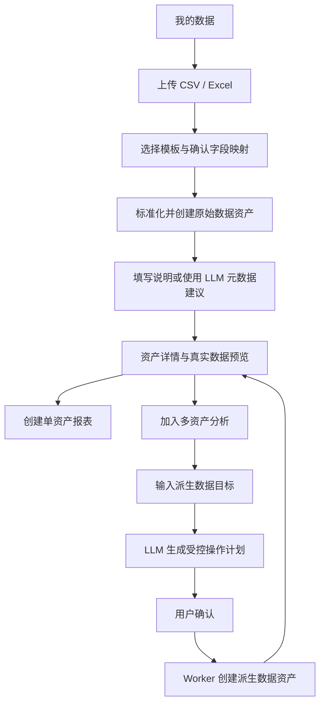

# 数据资产平台设计

- 日期：2026-07-17
- 状态：待书面规格确认
- 用户边界：单个可信用户自用

## 1. 背景与目标

系统的主对象是可长期复用的数据资产，不是一次性加工任务，也不是预置业务脚本。用户将 CSV 或 Excel 按模板标准化为数据资产；可以预览和识别资产、基于一份资产创建报表、或选择多份资产生成新的派生资产。

第一期目标是让用户可靠地完成“上传表格、识别数据、预览真实数据、创建单资产报表”。第二期增加受控的多资产派生加工。普通用户不接触脚本目录、候选代码或 GitHub Pull Request。

## 2. 已确认的产品决策

- 字段映射完成后，Worker 确定性地将文件转换为标准化 NDJSON；该过程不调用 LLM。
- 每次上传生成一项 `source` 原始数据资产；派生加工生成 `derived` 派生数据资产。
- 元数据仅用于识别、检索、筛选和人工判断，不参与默认数据计算。
- 元数据不预设全平台固定业务字段；第一期统一采用名称、描述、标签和系统基础信息。
- 用户可以输入自然语言说明，LLM 仅生成名称、摘要和标签建议；用户确认或编辑后的结果才会写入资产。
- 每项资产必须有真实数据预览、字段映射和来源/血缘信息；元数据不能替代预览。
- 单资产报表不产生新资产；多资产关联、合并、聚合或衍生字段计算才产生新资产。
- LLM 不读取真实数据行、R2 Key、密钥或文件地址，不直接生成和执行任意 TypeScript/JavaScript/SQL。
- LLM 生成的受控加工计划在用户确认后直接写入 R2 并立即可执行；不走候选源码、GitHub Pull Request、CI 合入或 Worker 重新部署。
- LLM 对报表生成受限配置，对派生加工生成受控操作计划；Worker 使用 Zod 校验并执行计划。
- 当前销售示例脚本仅可作为内部测试或未来底层扩展，不出现在普通用户主流程。

## 3. 用户流程



## 4. 数据资产模型

### 4.1 资产

```ts
type DataAsset = {
  id: string
  kind: 'source' | 'derived'
  templateId: string
  name: string
  description: string | null
  tags: string[]
  dataObjectKey: string
  schemaObjectKey: string
  previewObjectKey: string | null
  rowCount: number
  status: 'ready' | 'processing' | 'failed'
  createdBy: string
  createdAt: string
  updatedAt: string
}
```

- `source`：用户上传文件经字段映射、严格类型转换后生成。
- `derived`：一份或多份 `ready` 资产经过已确认操作计划生成。
- `name` 初始值为去掉扩展名后的原文件名；若用户确认 LLM 建议，以确认值替换。
- `description` 可以为空；`tags` 可以为空数组，不以推测业务字段兜底。
- 数据文件为 NDJSON，Schema、预览和元数据为 JSON；D1 只保存索引、状态和对象 Key。

### 4.2 血缘

```text
asset_lineage
- child_asset_id
- parent_asset_id
- transformation_id
- position
```

原始资产保留上传文件来源；派生资产至少保留父资产、操作计划 ID、用户目标和创建时间。禁止形成资产依赖环。

### 4.3 元数据建议

LLM 建议协议：

```ts
type AssetMetadataSuggestion = {
  name: string
  description: string
  tags: string[]
}
```

LLM 输入只包含用户填写的说明和安全的系统基础信息（模板名、原文件名、创建时间、行数）。若调用失败或协议无效，资产仍可保存，页面只显示“未生成建议”；不得阻塞标准化数据资产创建。

### 4.4 样例行授权

默认情况下，LLM 只接收资产 Schema、名称、行数和用户需求。用户在创建报表或派生加工时可以主动勾选“将当前预览的前 5 行样例发送给模型”，以辅助模型理解字段语义和数据形态。

- 授权默认关闭，按一次生成请求生效；
- 页面必须明确显示发送的是哪项资产及前 5 行预览；
- 样例不写入 D1、R2、报表配置、操作计划或日志；
- 不勾选时功能仍完整可用，LLM 不得要求用户授权样例才能生成方案。

## 5. 预览与资产中心

资产中心默认采用表格优先布局，展示：名称、类型、模板、标签、行数、创建时间和操作。支持按模板、类型、标签、创建时间和关键词筛选；每行提供预览、创建报表和加入分析操作。

资产详情至少包含：

- 可编辑名称、描述、标签；
- 原始表头到标准字段的映射与类型；
- 前 50 行标准化后的真实数据预览；
- 总行数、模板、创建人、创建时间；
- 原始上传文件或派生血缘；
- “创建报表”和“加入分析”操作。

预览 API 使用固定最大行数和确定排序，不支持从浏览器下载完整 R2 对象作为预览替代。完整导出不属于本期范围。

资产详情采用数据预览优先布局：顶部紧凑展示资产类型、模板、行数、创建时间和标签；真实数据预览紧随其后；字段映射和来源/血缘在同一页后续区块展示，不以多层标签页隐藏真实数据。

## 6. 单资产报表

报表只能绑定一项 `ready` 数据资产的精确版本。LLM 输入：资产 Schema、允许的固定组件与聚合规则、用户展示需求；不输入真实数据行。

创建报表页使用双栏布局：左栏展示当前资产的前 5 行预览和可点击插入 Prompt 的字段名，右栏填写展示需求并生成预览。用户勾选样例授权时，左栏当前展示的前 5 行随本次请求发送给 LLM；未勾选时只发送 Schema。

第一期组件：

- 明细表；
- 指标卡；
- 柱状图、折线图、饼图；
- 单选、多选、日期范围筛选。

第一期聚合：`count`、`sum`、`average`、`min`、`max`。排序和筛选仅引用真实字段。LLM 生成的配置必须经过 `report-schema` 校验后才能预览和发布。

“查看明细、最高分、平均分、及格率、成绩分布”等都是单资产报表需求，不创建派生数据资产。

## 7. 派生加工

### 7.1 操作计划

多资产加工由 LLM 生成 `TransformationPlan` 草稿，用户确认后执行：

```ts
type TransformationPlan = {
  inputAssetIds: string[]
  operations: TransformationOperation[]
  output: {
    name: string
    description: string
  }
}
```

第一期受控操作集合：

- `project`：选择字段或重命名字段；
- `filter`：按表达式过滤；
- `join`：两项资产按类型兼容字段关联；
- `append`：同 Schema 资产纵向合并；
- `derive`：按受控表达式生成字段；
- `aggregate`：分组计数、求和、均值、最大值、最小值；
- `sort`：排序；
- `limit`：限制输出行数。

表达式使用结构化 AST，不接受字符串公式：

```ts
type Expression =
  | { type: 'field'; assetAlias: string; name: string }
  | { type: 'literal'; value: string | number | boolean | null }
  | { type: 'binary'; operator: 'add' | 'subtract' | 'multiply' | 'divide'; left: Expression; right: Expression }
  | { type: 'compare'; operator: 'equal' | 'notEqual' | 'greaterThan' | 'lessThan'; left: Expression; right: Expression }
  | { type: 'logical'; operator: 'and' | 'or'; left: Expression; right: Expression }
  | { type: 'not'; value: Expression }
```

### 7.2 执行约束

Worker 在排队前验证：资产状态、字段存在性、字段类型、关联键类型、输出字段重名、表达式类型、行数限制和无环血缘。执行时仅读取用户确认的资产版本，流式输出新的 NDJSON、Schema、摘要与血缘；失败不覆盖父资产或已有结果。

确认后的 `TransformationPlan` 以不可变 `plan.json` 写入 R2，D1 仅记录计划 ID、输入资产、状态、R2 Key 和输出资产 ID。Worker 内置解释器读取并执行该 JSON；计划无需编译或部署即可运行。禁止将 LLM 返回的任意 TypeScript、JavaScript、SQL 或可执行二进制上传 R2 后动态执行。

创建派生数据页同样使用双栏布局：左栏在已选择资产之间切换预览，并展示可插入需求的字段；右栏填写加工目标。生成的确认页以自然语言说明输入资产、关联方式、计算字段、排序和预计输出，不向普通用户暴露 DSL 或底层脚本。

派生资产可以继续作为后续派生加工和单资产报表的输入。

## 8. API 轮廓

```text
POST /api/assets/uploads
POST /api/assets/{id}/mapping
POST /api/assets/{id}/metadata-suggestions
PUT  /api/assets/{id}/metadata
GET  /api/assets
GET  /api/assets/{id}
GET  /api/assets/{id}/preview

POST /api/asset-reports/drafts
POST /api/report-versions/{id}/confirm

POST /api/transformations/drafts
POST /api/transformations/{id}/confirm
GET  /api/transformations/{id}
```

上传和映射接口可以内部复用现有文件检查、映射和标准化执行能力，但对页面统一返回资产 ID。报表接口改为接收资产 ID；加工接口接收一组资产 ID 和用户目标。

## 9. 页面信息架构

主导航：`我的数据`、`上传数据`、`分析模板`、`我的报表`。

普通用户页面不展示“发起数据加工”“已启用脚本”“候选代码”或 GitHub PR。资产详情根据资产状态显示：预览、编辑信息、创建报表、加入分析、查看血缘。整体 UI 使用统一的操作栏、标签、表格、空状态、加载状态和错误状态，避免大块空白的原型化界面。

## 10. 迁移策略

1. 保留现有上传、文件检查、字段映射、严格类型转换和 R2 NDJSON 写入。
2. 将映射后的 baseline 任务结果登记为 `source` 数据资产，作为新主链路的首个可见对象。
3. 增加资产元数据、列表、详情和预览；旧 `datasets` 与 `dataset_versions` 在迁移期保留为上传控制面记录。
4. 报表从依赖 `taskId` 逐步迁移为依赖 `assetId`；历史报表保留原始任务关联，不静默改写。
5. 新建转换计划 DSL、派生资产和血缘，不复用面向业务示例的预置脚本选择 UI。
6. `scripts`、候选 PR 和目录同步不再承担数据加工能力；可以在后续评估为内部平台维护工具，但不进入本期范围。

## 11. 验收标准

- 用户能上传一份成绩表、完成字段映射，得到可预览的数据资产。
- 用户能输入模糊说明并确认/编辑 LLM 建议的名称、摘要、标签；LLM 失败不阻塞资产创建。
- 用户能在资产列表通过名称、标签、模板和时间识别目标数据，并从详情查看真实预览。
- 用户能在创建报表或派生加工时查看当前选择资产的真实预览，并点击字段名辅助撰写需求。
- 用户可明确授权本次发送前 5 行样例给 LLM；不授权时 LLM 仍只接收 Schema，且样例内容不被持久化或写入日志。
- 用户能基于单份资产生成并发布包含明细、指标、图表的受限报表。
- 用户能选择两份兼容资产，确认关联与差值计算计划，得到可继续使用的派生资产。
- LLM 永不接收真实数据行，且任何加工均不能执行任意代码。
- 用户确认的受控加工计划直接保存到 R2 并可立即执行，无需创建 PR、等待 CI 或重新部署。
- 普通用户流程中不出现销售示例脚本、候选代码或 GitHub PR。
